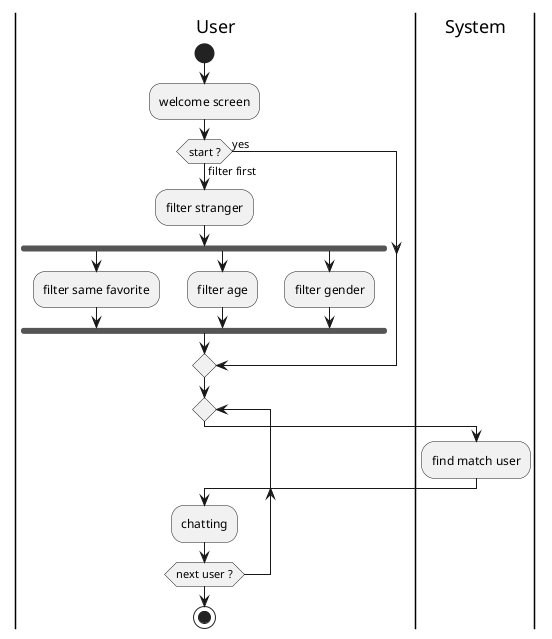

# Chat activity diagram

```plantuml
@startuml

|User|
start
:welcome screen;
if (start ?) then (filter first)
:filter stranger;
fork
    :filter same favorite;
fork again
    :filter age;
fork again
    :filter gender;
endfork
else (yes)
endif
repeat
    |System|
    :find match user;
    |User|
    :chatting;
repeat while (next user ?)
stop

@enduml
```