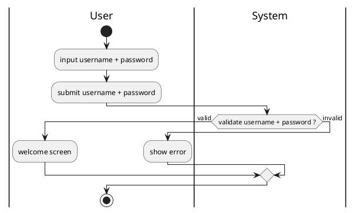

# Sign in activity diagram

```plantuml
@startuml

|User|
start
:input username + password;
:submit username + password;
|System|
if (validate username + password ?) then (valid)
    |User|
    :welcome screen;
else (invalid)
    |User|
    :show error;
endif
stop

@enduml
```