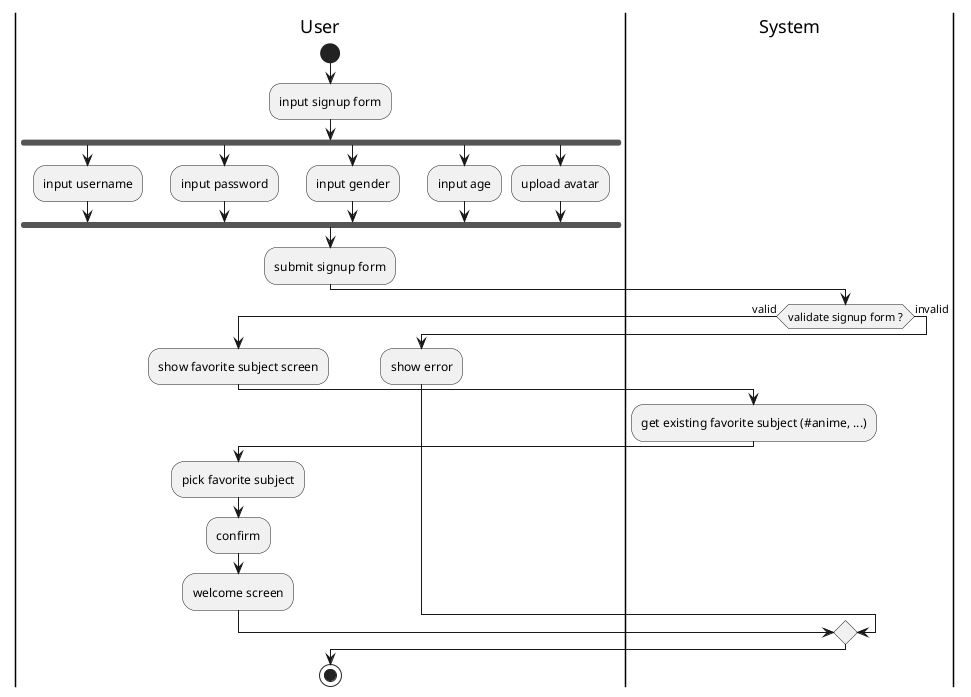

# Sign up activity diagram

```plantuml
@startuml

|User|
start
:input signup form;
fork
    :input username;
fork again
    :input password;
fork again
    :input gender;
fork again
    :input age;
fork again
    :upload avatar;
endfork
:submit signup form;
|System|
if (validate signup form ?) then (valid)
    |User|
    :show favorite subject screen;
    |System|
    :get existing favorite subject (#anime, ...);
    |User|
    :pick favorite subject;
    :confirm;
    :welcome screen;
else (invalid)
    |User|
    :show error;
endif
stop

@enduml
```