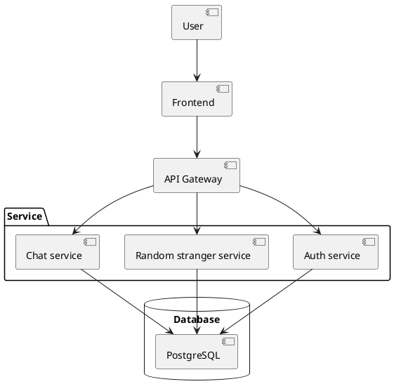

# Architecture diagram

```plantuml
@startuml


[User] --> [Frontend]

[Frontend] --> [API Gateway]

package Service {
    [API Gateway] --> [Auth service]

    [API Gateway] --> [Random stranger service]

    [API Gateway] --> [Chat service]
}

database Database {
    [Auth service] --> [PostgreSQL]

    [Random stranger service] --> [PostgreSQL]

    [Chat service] --> [PostgreSQL]
}

@enduml
```