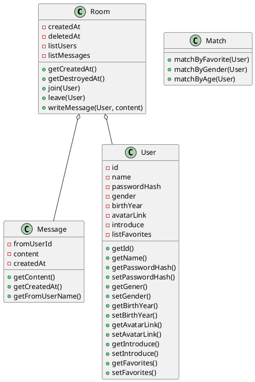

# Class diagram

```plantuml
@startuml

Room o-- Message
Room o-- User

class Room {
    - createdAt
    - deletedAt
    - listUsers
    - listMessages
    + getCreatedAt()
    + getDestroyedAt()
    + join(User)
    + leave(User)
    + writeMessage(User, content)
}

class User {
    - id
    - name
    - passwordHash
    - gender
    - birthYear
    - avatarLink
    - introduce
    - listFavorites
    + getId()
    + getName()
    + getPasswordHash()
    + setPasswordHash()
    + getGener()
    + setGender()
    + getBirthYear()
    + setBirthYear()
    + getAvatarLink()
    + setAvatarLink()
    + getIntroduce()
    + setIntroduce()
    + getFavorites()
    + setFavorites()
}

class Message {
    - fromUserId
    - content
    - createdAt
    + getContent()
    + getCreatedAt()
    + getFromUserName()
}

class Match {
    + matchByFavorite(User)
    + matchByGender(User)
    + matchByAge(User)
}

@enduml
```