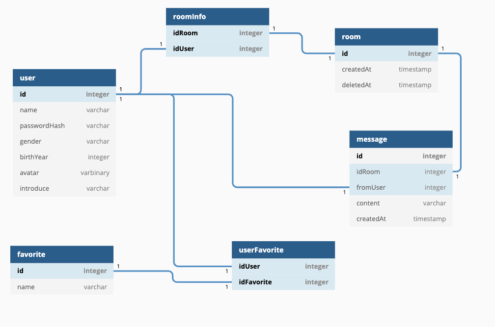

# Database diagram

```
Table user {
  id integer [pk]
  name varchar
  hash varchar
  gender varchar
  birth_year integer
  avatar varbinary
  introduce varchar
}

Table favorite {
  id integer [pk]
  name varchar
}

Table user_favorite {
  id_user integer [pk, ref: - user.id]
  id_favorite integer [pk, ref: - favorite.id]
}

Table room {
  id integer [pk]
  created_at timestamp
  destroyed_at timestamp  
}

Table room_info {
  id_room integer [pk, ref: - room.id]
  id_user integer [pk, ref: - user.id]
}

Table message {
  id integer [pk]
  id_room integer [ref: - room.id]
  from_user integer [ref: - user.id]
  content varchar
  created_at timestamp
}
```

[At dbdiagram.io](https://dbdiagram.io/d/5ccfee17f7c5bb70c72fe140)

