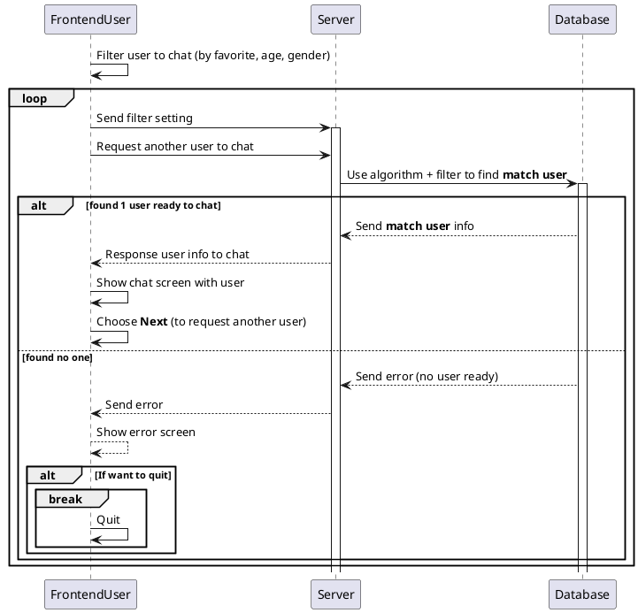

# Chat sequence diagram

```plantuml
@startuml

FrontendUser -> FrontendUser: Filter user to chat (by favorite, age, gender)

loop
    FrontendUser -> Server: Send filter setting
    activate Server

    FrontendUser -> Server: Request another user to chat

    Server -> Database: Use algorithm + filter to find **match user**
    activate Database

    alt found 1 user ready to chat
        Database --> Server: Send **match user** info
        Server --> FrontendUser: Response user info to chat
        FrontendUser -> FrontendUser: Show chat screen with user
        FrontendUser -> FrontendUser: Choose **Next** (to request another user)
    else found no one
        Database --> Server: Send error (no user ready)
        Server --> FrontendUser: Send error
        FrontendUser --> FrontendUser: Show error screen
        alt If want to quit
            break
                FrontendUser -> FrontendUser: Quit
            end
        end
    end
end

@enduml
```