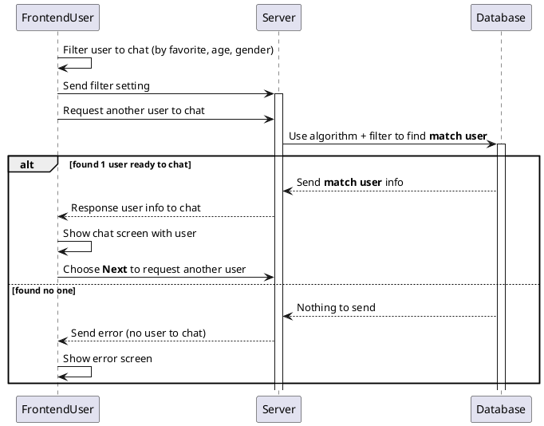

# Chat sequence diagram

```plantuml
@startuml

FrontendUser -> FrontendUser: Filter user to chat (by favorite, age, gender)

FrontendUser -> Server: Send filter setting
activate Server

FrontendUser -> Server: Request another user to chat

Server -> Database: Use algorithm + filter to find **match user**
activate Database

alt found 1 user ready to chat
    Database --> Server: Send **match user** info
    Server --> FrontendUser: Response user info to chat
    FrontendUser -> FrontendUser: Show chat screen with user
    FrontendUser -> Server: Choose **Next** to request another user
else found no one
    Database --> Server: Nothing to send
    Server --> FrontendUser: Send error (no user to chat)
    FrontendUser -> FrontendUser: Show error screen
end

@enduml
```