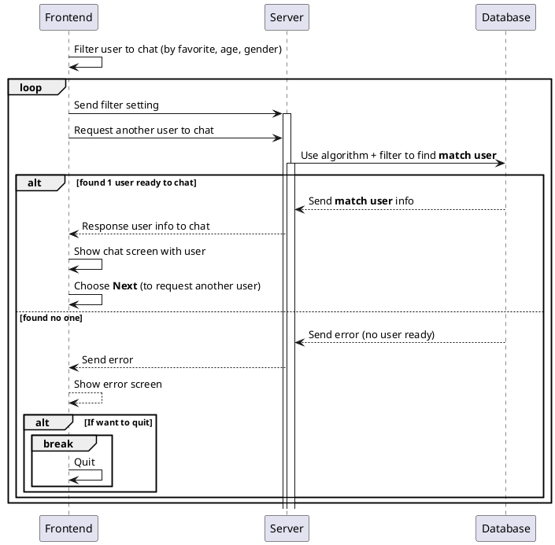

# Chat sequence diagram

```plantuml
@startuml

Frontend -> Frontend: Filter user to chat (by favorite, age, gender)

loop
    Frontend -> Server: Send filter setting
    activate Server

    Frontend -> Server: Request another user to chat

    Server -> Database: Use algorithm + filter to find **match user**
    activate Server

    alt found 1 user ready to chat
        Database --> Server: Send **match user** info
        Server --> Frontend: Response user info to chat
        Frontend -> Frontend: Show chat screen with user
        Frontend -> Frontend: Choose **Next** (to request another user)
    else found no one
        Database --> Server: Send error (no user ready)
        Server --> Frontend: Send error
        Frontend --> Frontend: Show error screen
        alt If want to quit
            break
                Frontend -> Frontend: Quit
            end
        end
    end
end

@enduml
```